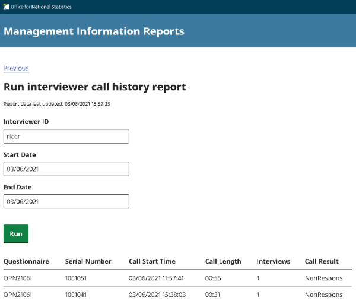
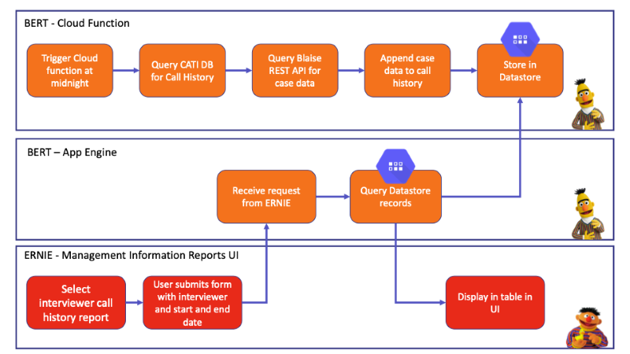

# Blaise Management Information Reports 

[](https://codecov.io/gh/ONSdigital/blaise-management-information-reports)


[](https://github.com/ONSdigital/blaise-management-information-reports/pulls)
[](https://github.com/ONSdigital/blaise-management-information-reports/commits)
[](https://github.com/ONSdigital/blaise-management-information-reports/graphs/contributors)
[](https://lgtm.com/projects/g/ONSdigital/blaise-management-information-reports/alerts/)
[](https://lgtm.com/projects/g/ONSdigital/blaise-management-information-reports/context:javascript)

Web-based user interface for running and viewing management information reports.



This project is a React.js application which when built is rendered by a Node.js express server.

The application is being deployed to Google App Engine.

The application calls API endpoints from the BERT application to receive the management information data.



### Local Setup

Install [Node.js](https://nodejs.org/) and [Yarn](https://yarnpkg.com/) if you haven't already done so.

Clone the repository:

```shell script
git clone https://github.com/ONSdigital/blaise-management-information-reports.git
```

Create an .env file in the root of the project and add the following variables:

| Variable | Description | Example |
| --- | --- | --- |
| PROJECT_ID | The unique GCP project ID. Set to anything when testing locally. | blah |
| BERT_URL | The base URL the application will use to formulate URLs for API calls. Consider giving "IAP-secured Web App User" permission to "allUsers" in a sandbox when testing locally. | https://dev-bert.social-surveys.gcp.onsdigital.uk |
| BERT_CLIENT_ID | For authenticating with BERT in locked down formal environments. Set to anything when testing locally. | blah |


Install the project dependencies:

```shell script
yarn install
```

Run Node.js via the package.json script:

```shell script
yarn start-server
```

Run React.js via the package.json script:

```shell script
yarn start-react
```

The UI should now be accessible via:

http://localhost:3000/

Tests can be run via the package.json script:

```shell script
yarn test
```

Test snapshots can be updated via:

```shell script
yarn test -u
```

### Playwright tests 

To set up Playwright tests <i>locally</i> your .env file will need the following variables:

| Variable | Description | Example |
| --- | --- | --- |
| CATI_URL | The URL to CATI | https://dev-cati.social-surveys.gcp.onsdigital.uk |
| CATI_USERNAME | The username to log in to CATI | foobar |
| CATI_PASSWORD | The password to log in to CATi | foobar |
| REPORTS_URL | The URL to ERNIE | https://dev-reports.social-surveys.gcp.onsdigital.uk |
| REST_API_URL | The URL to swagger | http://localhost:8000 |
| TEST_INSTRUMENT | The name of the test instrument in the DQS bucket (this instrument needs to be configured for appointments) | DST2111Z |
| SERVER_PARK | The name of the server park | gusty |

You <i>may</i> also need to run the following command to export the environment variables:

```shell script
export $(cat .env | xargs)
```

Select the environment to connect to the rest-api, for example where PROJECT-ID is ons-blaise-v2-dev-<SANDBOX>:
```shell script
gcloud config set project <PROJECT-ID>
```

Open the tunnel the to rest api:
```shell script
gcloud compute start-iap-tunnel restapi-1 80 --local-host-port=localhost:8000
```

(In a different terminal) Playwright tests can be run via:

```shell script
yarn run playwright test tests
```

Or a live demo can be run via:

```shell script
yarn run playwright test tests --headed
```

#### To help debug:
```shell script
export TRACE=true
yarn run playwright test tests
```
and once the tests have finished run the following, where <TEST-NAME> is the title of test.describe() and the test. For example, 'Without-data-I-can-get-to-and-run-an-ARPR-for-a-day-with-no-data':
```shell script
yarn run playwright show-trace test-results/tests-integration-arpr-<TEST-NAME>-chromium/trace.zip
```

